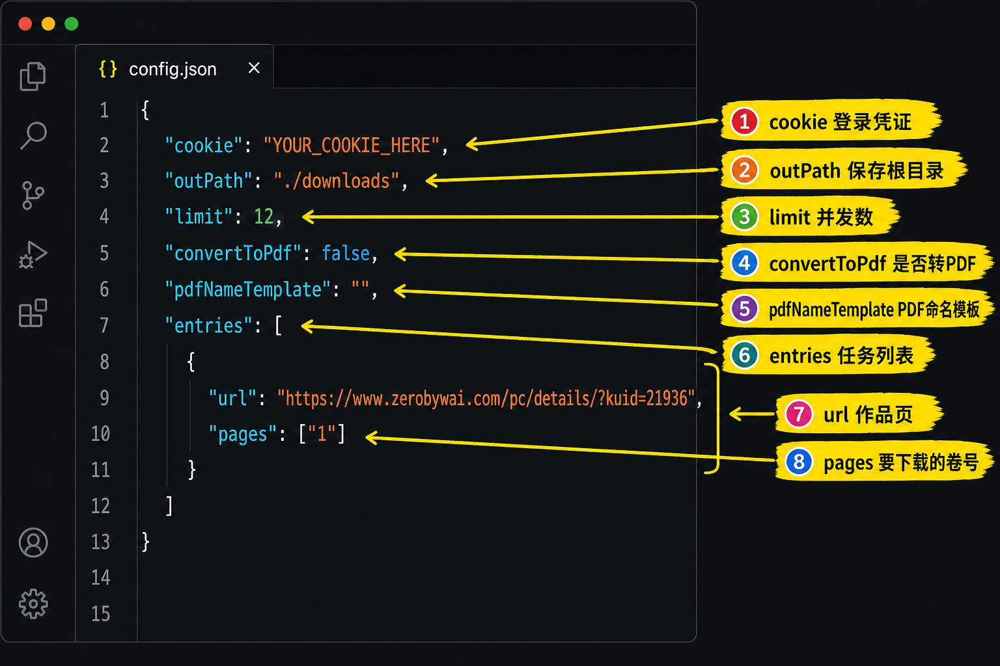

# zero-manga-downloader

从 zerobywai 等站点按配置下载漫画图片的 Go 命令行工具。

## `config.json` 图解（字段说明）

下图为**脱敏后的示意配图**（`cookie` 已替换为占位符）。请勿将带**真实 Cookie** 或本机绝对路径的编辑器截图直接提交到公开仓库。



图中「记号笔」式编号与下表一一对应：

| 标注 | JSON 位置 | 说明 |
|:----:|-------------|------|
| ① | 根对象 `"cookie"` | 在浏览器登录 zerobywai 后，从开发者工具复制请求 Cookie；会员/受限话数通常必需。提交代码前请保持占位符或本地私有配置。 |
| ② | 根对象 `"outPath"` | 下载根目录（相对或绝对路径均可）；程序会在其下按「作品标题 → 章节文件夹」存放图片。 |
| ③ | 根对象 `"limit"` | 同一话内**并发下载图片**的协程上限；配置里 ≤0 或 >200 时会在加载配置时被修正为 200。 |
| ④ | 根对象 `"convertToPdf"` | `true` 时，每一话图片全部下完后，在同作品目录下**额外**生成该话 PDF；**不会删除**已下载的图片。 |
| ⑤ | 根对象 `"pdfNameTemplate"` | PDF 文件名模板；可用 `{chapter}` 表示章节名/卷号（与下载子目录名一致）。留空则 PDF 名为「章节名.pdf」。 |
| ⑥ | 根对象 `"entries"` | 下载任务**数组**；可配置多部作品或多组 `pages`。 |
| ⑦ | `entries[].url` | 作品页地址；支持 PC 详情页 `.../pc/details/?kuid=...`、阅读器 `.../pc/manga_pc.php?kuid=...`、旧版 `plugin.php?...` 等（详见下文「支持的 url 形态」）。 |
| ⑧ | `entries[].pages` | 要下载的卷/话编号列表（JSON **字符串数组**）；每条可为**单卷**（如 `"1"`）或**范围** `"xx-yy"`；**多条可并列、并与范围混写**（见下文「`pages` 写法」）。解析后去重、排序，用于过滤章节。 |

## 配置说明（`config.json`）

| 字段 | 说明 |
|------|------|
| `cookie` | 浏览器登录后的 Cookie（会员章节等需要） |
| `outPath` | 输出根目录 |
| `limit` | 并发下载数（1–200，超出会按配置逻辑裁剪） |
| `convertToPdf` | 为 `true` 时，每个章节下载完成后在同作品目录下**额外**生成一个 PDF（一页一图，顺序与网页中的图片列表一致）。**各章节的原始图片目录会保留，不会被删除。** |
| `pdfNameTemplate` | PDF 文件名模板。可使用占位符 `{chapter}`，会替换为该卷的章节名/编号（与下载子目录名一致）。留空则 PDF 文件名为「章节名 + `.pdf`」 |
| `entries` | 下载任务列表，每项含 `url`、`pages`（`pages` 支持单卷、`xx-yy` 范围及组合，见下文「`pages` 写法」），可选 `pdfNameTemplate` 覆盖全局的 `pdfNameTemplate` |

**支持的 `entries.url` 形态（站点改版后常用 PC 详情页）：**

- `.../pc/manga_pc.php?kuid=...`（阅读器入口，内嵌 `const chapters`）
- `.../pc/details/?kuid=...` 或 `.../pc/details?kuid=...`（作品详情 + 章节网格，内嵌 `mangaDownloadChapters`，阅读地址为 `/pc/view/index.php?zjid=...`）
- 旧版 `plugin.php?id=jameson_manhua&...`（依赖原目录 DOM）

### `entries[].pages` 写法

`pages` 为**字符串数组**。每个元素是一段卷号描述，支持：

| 写法 | 含义 | 示例（数组中的一项） |
|------|------|----------------------|
| 单卷 | 只下载该话/卷 | `"1"`、`"12"` |
| 连续范围 `xx-yy` | 从 `xx` 到 `yy`（含两端） | `"3-5"` 表示 3、4、5 |
| 多个并列 | 在数组里写**多个字符串**，表示「若干单卷或范围」一起生效 | `["1", "3", "10"]` 表示 1、3、10 |
| **组合** | **单卷、范围、多段** 可写在**同一** `pages` 数组里混用 | `["1", "3-5", "7", "10-12"]` 表示 1、3～5、7、10～12 |

说明：

- JSON 里用**逗号**分隔的是**数组里的多个字符串**；**不是**在一个字符串里写 `"1,3,5"`（解析器把每条当成「纯数字」或「`数字-数字` 范围」，**不支持**单条内含英文逗号列表）。
- 不同条目之间的重复卷号（例如 `"2-5"` 与 `"4-8"`）会**去重**；最终会**按卷号排序**后再下载。

### PDF 命名示例

- 不开启：`"convertToPdf": false`
- 开启且使用章节原名：`"convertToPdf": true`, `"pdfNameTemplate": ""` → 若章节文件夹为 `12`，则生成 `12.pdf`
- 自定义前缀：`"pdfNameTemplate": "某作品_{chapter}"` → `某作品_12.pdf`
- 单条任务覆盖全局：在对应 `entries` 项中设置 `"pdfNameTemplate": "..."`。

为安全起见，模板中若出现路径分隔符，最终文件名会按 `filepath.Base` 处理，只保留最后一段作为文件名。

## 如何开启 PDF 转换（简要教程）

1. **打开配置文件**  
   与可执行文件同目录下的 `config.json`（若还没有，可复制仓库里的示例再改）。

2. **打开总开关**  
   把根级的 `"convertToPdf"` 从 `false` 改成 **`true`**。  
   保存后，每个章节在**图片全部下载完成**后，会在**同一部作品目录**里多生成一个 PDF（原始图片文件夹仍会保留）。

3. **（可选）自定义 PDF 文件名**  
   - 根级字段 **`pdfNameTemplate`**：  
     - 留空 `""`：PDF 文件名与章节文件夹名一致，例如章节文件夹是 `12`，则生成 `12.pdf`。  
     - 写模板：用 **`{chapter}`** 表示该话的章节名/编号（与下载下来的子目录名一致），例如 `"某漫画_{chapter}"` 会得到 `某漫画_12.pdf`。  
   - 若某条 `entries` 里需要**单独**命名，可在该条里加 **`pdfNameTemplate`**，会覆盖根级的设置。

4. **运行程序**  
   照常执行编译好的程序（或 `go run .`），按日志里「正在生成 PDF / PDF 已保存」确认是否成功。

5. **结果放在哪**  
   路径为：`outPath` → **作品标题文件夹** → 每个章节一个 **`.pdf` 文件**，与同名的**章节目录**（里面是图片）并列。例如：

   ```text
   /你的/outPath/作品标题/
     1/          ← 第 1 话的图片
     1.pdf       ← 第 1 话的 PDF（开启转换后）
     2/
     2.pdf
   ```

## Cursor / VS Code：提示找不到 `dlv`（Delve）

Go 扩展用 **Delve** 做「运行 / 调试」。可按需在本机添加 **`.vscode/settings.json`**，例如为扩展指定 `dlv` 路径（默认多为 `~/go/bin/dlv`，即 `$(go env GOPATH)/bin/dlv`；若安装位置不同，改成 `which dlv` 的输出）：

```json
{
  "go.alternateTools": {
    "dlv": "${env:HOME}/go/bin/dlv"
  }
}
```

也可添加 **`.vscode/tasks.json`**，用 `go run .` 作为 shell 任务，在 **Terminal → Run Task…** 里运行，**不依赖** `dlv`。

若仍报错，在终端执行安装（需已安装 Go 与网络）：

```bash
go install github.com/go-delve/delve/cmd/dlv@latest
```

然后把 **`$(go env GOPATH)/bin`** 加入系统 **PATH**，或继续使用上面的 `go.alternateTools` 指向实际 `dlv` 路径。

在 **`.vscode/launch.json`** 里为 Go 配置 **`"console": "integratedTerminal"`**，便于标准输入与日志在「终端」面板查看。

### Run without Debugging 时 Debug Console 停在 “Building…”

- **调试器/扩展** 的编译提示会出现在 **Debug Console**；真正程序日志在 **`console": "integratedTerminal"`** 时应看底部 **Terminal（终端）** 里新开的那一栏，请切换到 **Terminal** 面板。
- 若程序已结束但 Debug Console 仍像卡住，多半是之前在等非交互的 **`fmt.Scanln()`**；当前 `main.go` 会在标准输入不是终端时**自动跳过**等待。

## 运行测试（`go test`）

联网用例会请求 `www.zerobywai.com`。CI（如 GitHub Actions）**无 Cookie** 时，站点可能返回**空图列表**，测试仍校验章节与阅读页 URL 是否解析成功。

若在本机配置了有效 `Cookie` 并希望**强制**断言每话图片数大于 0，可执行：

```bash
TEST_REQUIRE_CHAPTER_IMAGES=1 go test -count=1 -race ./services -run TestGetComicPageInfo
```
